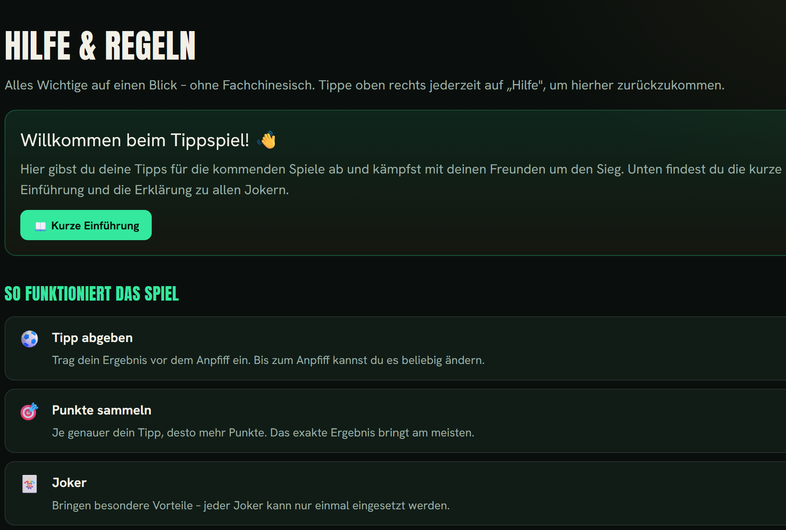

<div align="center">

# ORAKEL FC 2026 ⚽🔮

**Dis eigete WM-2026-Tippspiil für d Kollegerundi – sälber ghosted.**

[](LICENSE)


[🇩🇪 Deutsch](README.md) · [🇬🇧 English](README.en.md) · **🟥⚫ Baseldütsch (Baselland)**

</div>

> *Rede isch Silber. Richtig tippe isch Gold. Falsch tippe gits Gschpött i de Kaffepouse.*

> ⚠️ **Hiwiis:** Das do isch e gmüetlechi, experimentelli Übersetzig vom Readme uf Baseldütsch
> (Baselbieter Mundart). Mir hai kei offizielli Rächtschribig für Schwiizerdütsch, drum cha
> s sii, dass mir s eint oder ander Wort anders schriibe als du's gwennt bisch. Für d
> verbindlichi Dokumentation gilt s [Deutsch](README.md) bzw. [English](README.en.md) Readme.

Mit **Joker, gheime Mission, Challenges, Sunderwärtige und Chaos-Events** – und du chasch's
jederziit im Browser mit **neue Idee** uusbaue, ohni au nume ei Ziile Code aazfasse. Isch das
nid dis Ding? E Schalter macht draus es **eifachs Tippspiil**. E kompakti **Flask + SQLite**-App,
alles in **eim Docker-Container**: laift uf emene Raspberry Pi oder irgendemene Server, hinter
emene Reverse-Proxy (HTTPS).

## Features

- ⚽ **Tippe** mit Sperr zum Aapfiff, Risiko-Tipp pro Spiiltag (×2 / −4)
- 🏆 **Live-Tabälle** mit deterministischer Wärtig (Tendänz/Differänz/Exakt, K.-o.- und
  Underdog-Bonus)
- 🃏 **Joker** mit automatische Effäkt (Verdopple, Sabotage, Schutzschild, Tuusch, …) – cha
  mer fräi uusbaue
- 🔮 **Gheimi Mission**, 🎯 **Wuche-Challenges**, 🏅 **Sunderwärtige**, 🌀 **Chaos-Events** –
  alles im Browser editierbar
- 🎚️ **Nume-Tippspiil-Schalter** – blendet alli Extras mit eim Klick uus (klassischs Tippspiil)
- 🌍 **Zwöisprachig** (Dütsch / Änglisch), folgt em Browser und cha mer jederziit umschalte
- 📱 **Für s Händi optimiert**: undere Tab-Liste, grossi Buttons, Erstlogin-Tutorial, Hilf-Siite
- 🛠️ **Admin-Bereich**: Spieler, Spiilplan (au mit JSON-Import), Ergebnis, Punkt-Aapassige,
  Passwort-Reset
- 🔒 **Sicherheit**: CSRF-Schutz, Bruteforce-Bräms bim Login, gschiidi Sicherheits-Header,
  ghärteti Session-Cookies

## Screenshots

<!-- Leg dini PNGs in da docs/-Ordner und nimm denn d Kommentarzeiche wäg:
| Tabälle | Tippe | Hilf |
|:---:|:---:|:---:|
|  |  |  |
-->

_Leg es paar Screenshots in `docs/` ab und kommentier d Galerie obe uus – lueg im [Wiki](../../wiki)._

## Dokumentation

Usführlechi Aaleitige stoh im **[Wiki](../../wiki)**: Installation, Bedriib im Internet mit
HTTPS, Saison-Ablauf, Wärtigsräglä, Backups & Updates sowie e FAQ.

E Helfer-Skript (`wm2026_import.py`) laadt da kompletti WM-2026-Spiilplan vo
[openfootball](https://github.com/openfootball) und macht draus d Import-Datei.

---

## 1. Schnällstart (Docker)

```bash
# 1. Is Projektverzeichnis wächsle
cd orakel-fc

# 2. Konfiguration aalege und aapasse
cp .env.example .env
nano .env          # SECRET_KEY + ADMIN_PASSWORD setze!

# 3. Starte
docker compose up -d --build
```

D App lost jetzt uf **`127.0.0.1:8090`** (nume lokal – nach usse goht's über nginx,
lueg Schritt 3).

Logs aaluege / stoppe:
```bash
docker compose logs -f
docker compose down
```

### SECRET_KEY erzeuge
```bash
openssl rand -hex 32
```

---

## 2. Erschte Login

Mach `http://<pi-ip>:8090/login` uf (oder glich dini Domain noch Schritt 3) und mäld dich aa
mit de Date us dinere `.env` (Standard: `admin` / dis `ADMIN_PASSWORD`).

Dr Admin-Account **spiilt sälber nid mit** (taucht also nid i dr Tabälle uuf). Leg im
Admin-Bereich unter **Spieler** alli Mitspieler aa – jede:r übercho Name + Passwort.

---

## 3. Hinter dis nginx hänke

Du hesch Domain + nginx scho – s fehlt nume e vhost:

```bash
# 1. I dr Datei orakel-fc.nginx.conf d Domain aapasse, denn:
sudo cp orakel-fc.nginx.conf /etc/nginx/sites-available/orakel-fc
sudo ln -s /etc/nginx/sites-available/orakel-fc /etc/nginx/sites-enabled/

# 2. Teste + neu lade
sudo nginx -t && sudo systemctl reload nginx

# 3. HTTPS hole (certbot ergänzt da 443-Block automatisch)
sudo certbot --nginx -d orakel.dini-domain.tld
```

DNS-A-Record vo dr Subdomain uf dini IP zeige loh (bi dynamischer Heim-IP per DDNS/Domain-API
aktuell halte).

---

## 4. Saison-Ablauf

| Schritt | Wo | Was |
|--------|-----|-----|
| **Spieler aalege** | Admin → Spieler | Name + Passwort für jede:n |
| **Spiilplan iileise** | Admin → Spiil | Spiil einzeln aalege **oder** als JSON importiere |
| **Gheimi Mission verteile** | Admin → Mission zuweise | Jede:r übercho eini – gseht nume die eigeti |
| **Tippt wird** | vo de Spieler unter „Tippe" | Sperrt automatisch zum Aapfiff |
| **Ergebnis iitrage** | Admin → Spiil | Tor:Tor, ggf. „Überraschig"/„KO" aachräuze |
| **Joker** | Spieler unter „Joker", Admin gseht „Gspiilti Joker" | Automatischi Effäkt rächne sich sälber |
| **Sunderfäll** | Admin → Aapassige | Manuelle Bonus/Malus mit Begründig |
| **Challenge-/Award-Gwünner** | Admin → Katalog | Gwünner:in uuswähle, Punkt fliesse automatisch |

### Spiilplan-Import (JSON)
Unter *Admin → Spiil* e Liste iifüege:
```json
[
  {"home":"Mexiko","away":"Polen","kickoff":"2026-06-11T18:00","matchday":"1","stage":"Gruppe A"},
  {"home":"Kanada","away":"Schwiiz","kickoff":"2026-06-12T21:00","matchday":"1","stage":"Gruppe B","knockout":false}
]
```
Pflichtfälder: `home`, `away`, `kickoff` (`YYYY-MM-DDTHH:MM`). Optional: `matchday`, `stage`,
`knockout`. Dr WM-2026-Spiilplan übercho de zum Bischpiil gratis und ohni API-Key vo
**openfootball** (github.com/openfootball) und formsch en eimol in das Format um.

---

## 5. ⭐ Mit eigete Idee uusbaue (dr Clou)

Alli „Kataloge" sind **im Browser editierbar** – kei Deploy nötig. Im Admin-Bereich git's je
e Siite zum Aalege/Bearbeite/Lösche für:

- **Joker** · **Mission** · **Challenges** · **Sunderwärtige (Awards)** · **Chaos-Events**

Neui Idee = neue Iitrag, fertig. Du chasch chliin aafange und über d Saison immer me dezue packe.

### Joker-Automatik-Effäkt
Bim Aalege vomene Joker wählsch e `auto_effect`. D App rächnet die automatisch:

| Effäkt | Wirkig |
|--------|---------|
| `double` | Verdoppled d Punkt **vomene gwählte Spiil** |
| `triple` | Verdräifacht **e ganze Spiiltag** |
| `allin` | Tagesertrag uf 1 Spiil: Tendänz trifft → ×3, sunscht 0 |
| `lucky` | 0 Punkt aanem Spiiltag → trotzdäm 3 Trostpunkt |
| `sabotage` | Halbiert d Tagespunkt vomene Gegner |
| `shield` | Macht en Spiiltag immun gege Sabotage |
| `swap` | Schlächtischte Spiiltag zellt wie dr Liga-Durchschnitt |
| `manual` | Kei Automatik – du wärtisch en über **Aapassige** |

Für alles Kreative, wo mer nid automatisiere cha (Chaos-Joker, Wett-Iisätz, Kaffepouse-Bouße):
eifach `manual` wähle und d Punkt unter **Admin → Aapassige** mit Begründig buche
(positiv = Bonus, negativ wie `-4` = Malus).

---

## 6. Wärtigssystem

**Pro Tipp:**
- Richtigi Tendänz: **3**
- Richtigi Tordifferänz: **5**
- Exaktes Ergebnis: **8**

**Boni (nume bi richtiger Tendänz):**
- K.-o.-Spiil: **+2**
- Als „Überraschig" markiert: **+3**

**Risiko-Tipp** (max. 1 pro Spiiltag): richtig → **×2**, falsch → **−4**.

Dezue cho no Mission-, Challenge- und Award-Punkt sowie manuelli Aapassige. D Tabälle
aktualisiert sich live.

---

## 7. Backup & Update

**Alli Date** liege in einere einzige Datei: `./data/orakel.db`.
```bash
# Backup
cp data/orakel.db data/orakel-backup-$(date +%F).db
```

**Update** (Date bliibe erhalte, will im Volume):
```bash
git pull        # oder neui Datei iispiile
docker compose up -d --build
```

---

## 8. Sicherheit

- **`SECRET_KEY`** und **`ADMIN_PASSWORD`** in dr `.env` unbedingt ändere – ohni
  `SECRET_KEY` startet d App gar nid.
- Dr Container isch aa `127.0.0.1` bunde – vo usse nume über nginx + HTTPS erreichbar.
- Für e chlini Kollegerundi (5–15 Lüt) isch 1 Worker + SQLite ideal. Erscht bi sehr viel
  glichziitige Schriibzuegriff lohnt sich e Wächsel uf Postgres.

---

## 9. Tests

```bash
python3 -m venv .venv && . .venv/bin/activate
pip install -r requirements.txt
pip install pytest
python3 -m pytest tests/      # 52 Tests: Wärtigs-Engine, Login/Bruteforce/Open-Redirect, Route
```

---

## Projektstruktur

```
orakel-fc/
├── app.py                  # App-Setup: Konfiguration, Extensions, Blueprint-Registrierig
├── extensions.py           # db, csrf (Flask-Extension-Instanze)
├── models.py                # SQLAlchemy-Modäll (Player, Match, Tip, Joker, …)
├── auth.py                  # Login, Bruteforce-Schutz, Open-Redirect-Schutz, Decorators
├── scoring.py                # Wärtigs-Engine (Punktberächnig, Tabälle)
├── settings.py                # Key/Value-Iistellige (z. B. Nume-Tippspiil-Modus)
├── security.py                # HTTP-Sicherheits-Header
├── i18n_helpers.py            # Sprochuuswahl-Logik (nutzt i18n.py)
├── i18n.py                    # Übersetzigstabälle (Dütsch → Änglisch)
├── catalog_config.py          # Gmeinsami Konfiguration für Joker-Effäkt & Admin-Kataloge
├── routes/
│   ├── public.py            # Route für Spieler (Tippe, Joker, Tabälle, …)
│   └── admin.py              # Admin-Route (Spieler, Spiilplan, Kataloge, Aapassige)
├── templates/              # alli HTML-Siite
├── static/style.css        # ORAKEL-Design (dunkel, grüen/gold)
├── tests/                    # pytest-Suite (Wärtig, Auth, Route)
├── requirements.txt
├── Dockerfile
├── docker-compose.yml
├── orakel-fc.nginx.conf    # fertige nginx-Server-Block
└── .env.example            # Konfig-Vorlag
```

Viel Spass – und möge dr/die bescht Orakel gwinne. 🏆

---

## Lizenz

Veröffentlecht under dr **MIT-Lizenz** (lueg `LICENSE`). Du darfsch d Software fräi nutze,
aapasse und witergäh. Pull Requests und Idee sind willkomme.

## Mitwirke / Eigeti Instanz

1. Repo klone, `cp .env.example .env` und d Wärt setze (`SECRET_KEY`, `ADMIN_PASSWORD`).
2. `docker compose up -d --build` – d App laift uf `127.0.0.1:8090`.
3. Für dr Bedriib im Internet en Reverse-Proxy mit HTTPS dervorsetze (Nginx Proxy Manager,
   Caddy oder nginx + certbot) – Schritt für Schritt in `BETRIEB.md`.

> Hiwiis: `.env` und dr `data/`-Ordner (Datebank) sind in dr `.gitignore` uusgschlosse und
> ghöre **nie** is Repository.
