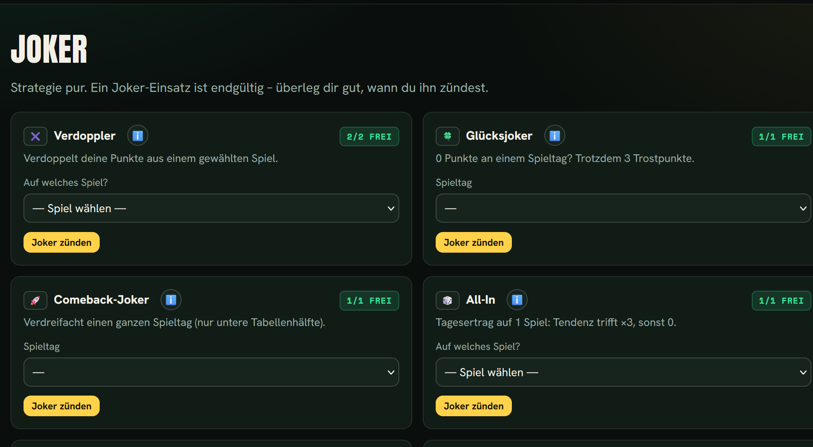

[🇬🇧 English](README.md) · **🇩🇪 [Deutsch](README.de.md)**

# ORAKEL FC 2026 ⚽🔮

A self-hosted **World Cup 2026 prediction game** for your group of friends — with **jokers, secret missions, weekly challenges, special awards and chaos events**. The best part: you can keep **adding your own ideas in the browser**, no coding required.

> *Talk is silver. Correct predictions are gold. Wrong ones are kitchen gossip.*

A compact **Flask + SQLite** app, everything in **one Docker container**. Runs on a Raspberry Pi or any server and sits behind a reverse proxy for HTTPS.

## Screenshots

| Table | Joker | Help |
|---|---|---|
|  |  |  |


## Features

- ⚽ **Predictions** that lock at kickoff, plus one risk pick per matchday (×2 / −4)
- 🏆 **Live standings** with a deterministic scoring engine (tendency / goal difference / exact, knockout & underdog bonus)
- 🃏 **Jokers** with automatic effects (double, sabotage, shield, swap, …) — fully extensible
- 🔮 **Secret missions**, 🎯 **weekly challenges**, 🏅 **awards**, 🌀 **chaos events** — all editable in the admin UI
- 📱 **Mobile-first**: bottom tab bar, large buttons, first-login tutorial, help page, add-to-home-screen
- 🛠️ **Admin area**: players, fixtures (incl. JSON import), results, manual point adjustments, password reset
- 🔒 Sensible security headers, hardened session cookies, simple backups (see `BETRIEB.md`, in German)

A helper script (`wm2026_import.py`) pulls the full WC 2026 fixture list from [openfootball](https://github.com/openfootball) and produces the import file (kickoff times converted to your timezone).

---

## Quickstart (Docker)

```bash
git clone https://github.com/<your-user>/orakel-fc-2026.git
cd orakel-fc-2026

cp .env.example .env
nano .env            # set SECRET_KEY + ADMIN_PASSWORD!

docker compose up -d --build
```

The app then listens on **`127.0.0.1:8090`**. Generate a strong secret with `openssl rand -hex 32`.

> Just trying it out? Temporarily change the port mapping to `"8090:8090"` to reach it on your LAN at `http://<server-ip>:8090`.

## First login

Open `http://<server>:8090/login` and sign in with the credentials from your `.env` (default user `admin`). The admin account does **not** appear in the standings. Under **Admin → Players** create one account (name + password) per participant.

## Run it on the internet (HTTPS)

Put a reverse proxy with a Let's Encrypt certificate in front — for example **Nginx Proxy Manager**, **Caddy**, or **nginx + certbot**. A ready nginx server block is included (`orakel-fc.nginx.conf`). A complete, beginner-friendly operations guide (HTTPS, auto-renewal, security headers, backups, updates) is in **`BETRIEB.md`** *(currently German — an English version is planned)*.

## Season workflow

1. **Players** – Admin → Players.
2. **Fixtures** – Admin → Matches: add them one by one or paste a JSON list (`wm2026_import.py` generates it).
3. **Secret missions** – Admin → Assign missions (each player sees only their own).
4. Participants **predict** before kickoff; predictions lock automatically.
5. **Results** – Admin → Matches: enter the score, optionally flag “surprise”/“knockout”. Standings update live.

## Add your own ideas

Jokers, missions, challenges, awards and chaos events are all **editable in the browser** (Admin → catalog pages). Start small and grow over the season. Jokers can carry an automatic effect (`double`, `triple`, `allin`, `lucky`, `sabotage`, `shield`, `swap`) or be `manual` (you award the points via Admin → Adjustments).

## Scoring

Per prediction: correct tendency **3**, correct goal difference **5**, exact result **8**. Bonuses (only on a correct tendency): knockout **+2**, flagged surprise **+3**. A risk pick (max one per matchday) doubles on a hit, or **−4** on a miss. Missions, challenges, awards and manual adjustments add on top.

## Backup & update

All data lives in a single file: `./data/orakel.db`. See `BETRIEB.md` for a ready-made backup script and the update flow. In short: copy new files in, then `docker compose up -d --build`.

## Tests

```bash
python3 -m venv .venv && . .venv/bin/activate
pip install -r requirements.txt
python test_scoring.py
```

---

## License

Released under the **MIT License** (see `LICENSE`). Use, modify and share it freely. Pull requests and ideas are welcome.

> Note: `.env` and the `data/` folder (database) are excluded via `.gitignore` and must **never** be committed.
